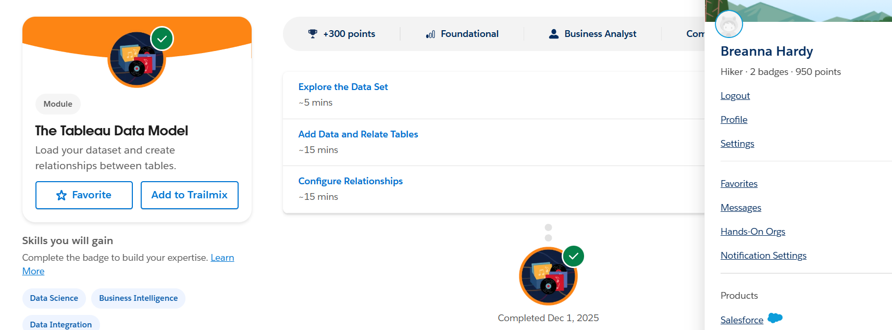
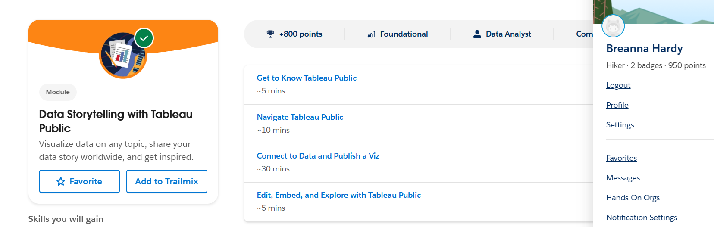
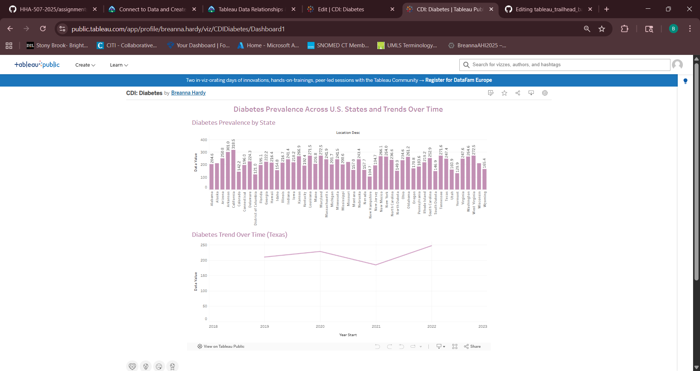

# Tableau Trailhead Basics
## i. Evidence Section 
### Completed Trailhead Modules

*Figure 1: Completed Trailhead module on Tableau Data Model.*

*Figure 2: Completed Trailhead module on Data Storytelling.*
### **Tableau Public Visualization**

*Figure 3: Dashboard showing diabetes prevalence across states and the changing trend in Texas from 2019 to 2022 using the CDC Chronic Disease Indicators dataset.*
<https://public.tableau.com/views/CDIDiabetes/Dashboard1?:language=en-US&:sid=&:redirect=auth&:display_count=n&:origin=viz_share_link>
## ii. Short Written Reflection
One data-storytelling principle I found most important was keeping the message simple and focused, which helped me design a viz that highlights only the most meaningful patterns in diabetes prevalence without being overwhelming. A key concept from the Tableau Data Model that stood out was understanding the difference between relationships and joins, because relationships keep each table at its correct level of detail and prevent duplicated or inflated values. This concept matters when working with real-world data, since healthcare datasets often include multiple tables for patients, visits, labs, and diagnoses. For example, a clinic tracking diabetes outcomes could relate visit-level data to lab results to evaluate A1c trends without accidentally counting the same patient more than once. Tableau supports this type of analysis by allowing clean data modeling and clear visual storytelling. Together, these features make Tableau an effective tool for improving insight generation in clinical and operational settings.
